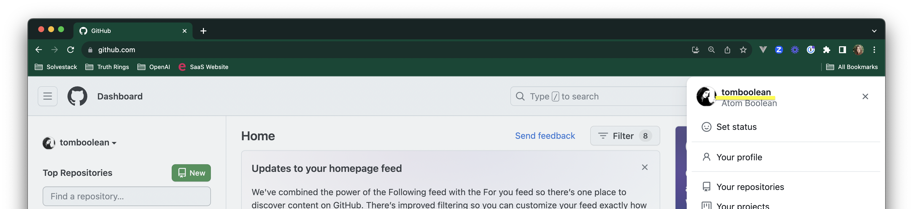
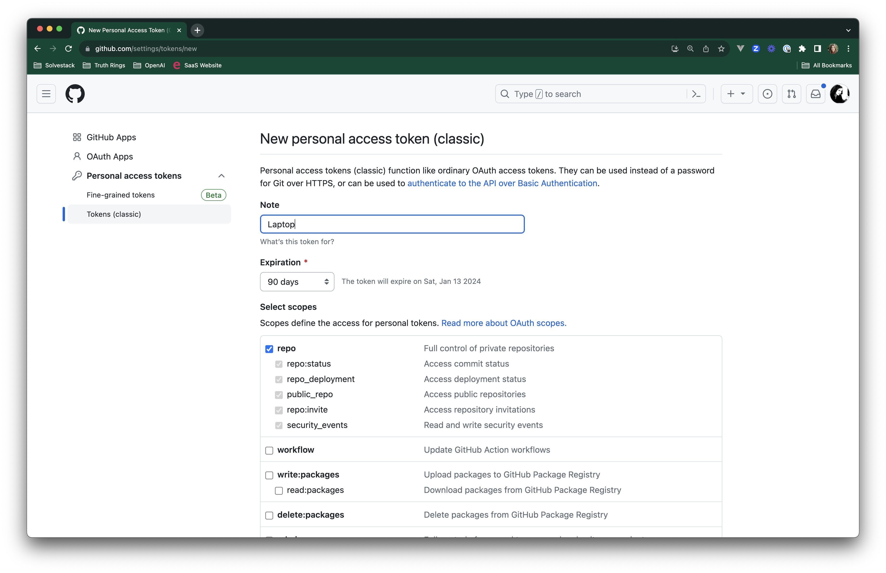
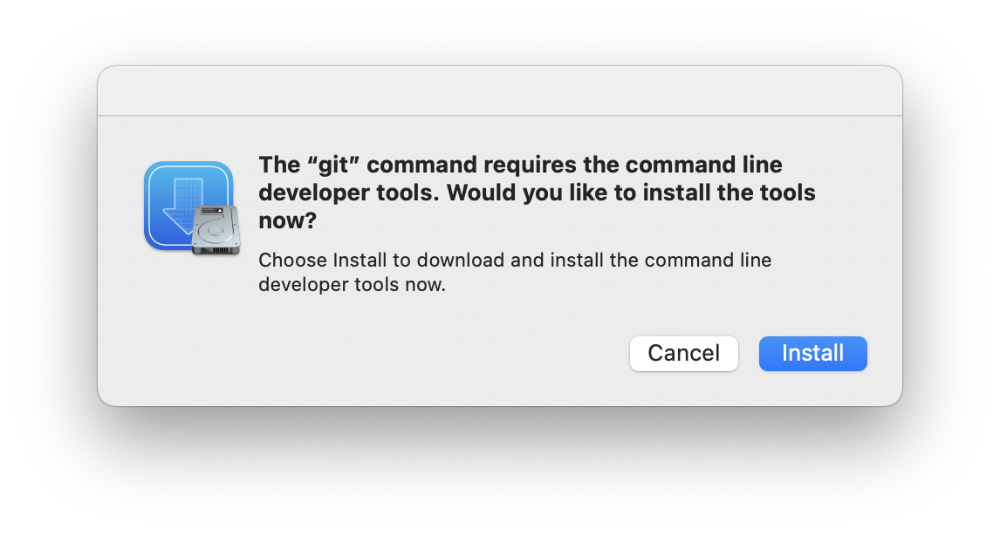

# solvestack-bootcamp-info

So you're ready to start your career in coding eh? It's gonna be fun. And exhausting. But we're gonna do it together! Your journey begins!

Congratulations for starting!

## Community

[Sign up for our Solvestack Slack](https://join.slack.com/t/solvestack/shared_invite/zt-9l9a253a-uCsIlUe8Gz4fllRGmEa~pw)

👋 See you there! We'll guide you during the meetup or with literally ANY question you have about coding. We like to help each other get unstuck.

Join the #solvestack-bootcamp channel in our Solvestack slack.

## Get Access to starting materials

### 1. Lessons
Navigate to the PY101 course materials: https://drive.google.com/drive/folders/1FcXSrAl7eRY-WcO7_9s9pDFNTeXXWLo3. Request access and I will add you.

### 2. Homework Assignments
[Solvestack Portal](https://portal.solvestack.com/course/view.php?id=2)

Send @anatomboulian your email address, first and last name in DM on slack and I will make a student account for you. You will receive an email with instructions on how to log in as follows:

```
Hi Ana Tomboulian,

A new account has been created for you at 'Solvestack'
and you have been issued with a new temporary password.

Your current login information is now:
username: ana.student
password: ***********
(you will have to change your password
when you login for the first time)

To start using 'Solvestack', login at
https://portal.solvestack.com/login/?lang=en_us

In most mail programs, this should appear as a blue link
which you can just click on. If that doesn't work,
then cut and paste the address into the address
line at the top of your web browser window.

Cheers from the 'Solvestack' administrator,

Admin User
```

Once logged in, click you should be able to click "Site Home" and see a list of available courses. Click on "PY101 - Intro to Python" and click “Enroll me".

You're in!

### 3. Install Python 3
On Windows: [Navigate to the Windows Store and click Get Button](https://apps.microsoft.com/store/detail/9P7QFQMJRFP7?hl=en-us&gl=US)

On Mac: [Pyenv](https://akrabat.com/creating-virtual-environments-with-pyenv/)

On Linux: [Pyenv](https://londonappdeveloper.com/install-and-configure-pyenv-on-linux/)


### 4. Run your Python REPL
Find where your Python 3 got installed.

Open your terminal, command prompt, or Powershell and run `python` or `python3`.

[Learn about your REPL](https://codewith.mu/en/tutorials/1.0/repl)


### 5. Get a Github account
* Create your account at github.com
* Find your username by clicking your avatar in the the top righthand corner



* DM one of the mentors above your github username on Slack
* Accept the organization invite by going to https://github.com/settings/organizations and clicking Accept

### 6. Create a personal access token
Go to https://github.com/settings/tokens/new and add a new "Classic" personal access token.

Give it the following scope:

- [x] repo


Copy this generated token and place it somewhere important and safe, [like a password manager](https://1password.com/).

### 7. Verify your Solvestack Github organization access:
Once you have accepted your organization invite to Solvestack, navigate to the following repository on GitHub:
https://github.com/SolveStack/bootcamp-PY101-auto-app

If you see a comical 404 page like the one below, you must DM to ask one of the mentors above for access to the repository via Slack.


If you see a file/folder structure, README.md and a green Code button on the righthand side, you have the proper access, and may continue.


### 8. Get the Repo downloaded (cloned)
A code repository (repo for short) is a folder containing code housed on servers from Github. There are other source control providers but the most popular one is Github. In order to open the code for use on your machine, you must download the code to physically store on your machine in a folder. As a developer, the most common way to do this is to clone the repository.

Now you must install Git if necessary:
* On Mac: install Xcode Command Line Tools.
* On Windows machine: install [Git Bash for Windows](https://gitforwindows.org/).

In order to clone the repository, you must open your Terminal. Here's how to open your terminal with Git access:
* On Mac: ⌘ + spacebar, type in "Terminal", hit enter
* On Windows: Windows key or Ctrl + Esc: Open Start menu. Type in "Git Bash", hit enter


Once you have opened your terminal with Git access, navigate to your workspace folder in your home directory, something like:

```bash
cd ~ # change directory into your home folder
mkdir git # if this is the first time you are creating your workspace folder
cd git # change directory into your new workspace folder called git
```

* Clone the repo:

```bash
git clone https://github.com/SolveStack/bootcamp-PY101-auto-app.git
```

Output looks like this:

```
Cloning into 'bootcamp-PY101-auto-app'...
Username for 'https://github.com': redacted
Password for 'https://<your-username-shows-here>@github.com':
```

When it asks for your password, give it your Personal Access Token you copied from Step 4:

```
remote: Enumerating objects: 158, done.
remote: Counting objects: 100% (158/158), done.
remote: Compressing objects: 100% (89/89), done.
remote: Total 158 (delta 79), reused 136 (delta 64), pack-reused 0
Receiving objects: 100% (158/158), 31.83 KiB | 434.00 KiB/s, done.
Resolving deltas: 100% (79/79), done.
```

If you get a prompt like this one, hit "Install":



Change directory into the newly cloned repo:

```bash
cd bootcamp-PY101-auto-app
git checkout starting-point
```

### 9. Open the Repository Locally
Download Visual Studio Code if you don't already have it: https://code.visualstudio.com/download

Then, open Visual Studio code, and click Open...

Navigate to the bootcamp-PY101-auto-app folder. Navigate to it like so: home -> git -> bootcamp-PY101-auto-app. Click open.

### 10. Set up your Debugger
Open the README.md for bootcamp-PY101-auto-app from here to set up your debugger.

## Syllabus: Intro to Python

Here is the syllabus:

### Lesson 1A
[Lesson - Intro:](https://colab.research.google.com/drive/1MEOd37KxEUIRqFo9wURjAsfCrRM3kJP5?usp=sharing)

* What is Programming?
* Datatypes
* Using the REPL
* Using files (scripts)
* No homework yet


### Lesson 1B

[Lesson: Variables, Operators and Comments](https://colab.research.google.com/drive/1ntkv6n7EQHucTGYY0UV_kltiZrrIHKtI?usp=sharing)
* Variables
* Operators
* Comments
* [Homework](https://portal.solvestack.com/mod/vpl/view.php?id=2)

### Lesson 2A
* [Lesson - Conditionals](https://colab.research.google.com/drive/1zAXuX0zGYYlVclX-d__8ELHTy2guWySE?usp=sharing)
* [Homework](https://portal.solvestack.com/mod/vpl/view.php?id=3)

### Lesson 2B
* [Lesson - Loops](https://colab.research.google.com/drive/1hn_4ltGXwUG6cI7nuD01AAqn0u13DUAI?usp=sharing)
* [Homework](https://portal.solvestack.com/mod/vpl/view.php?id=3)

### Lesson 3A
[Loesson - Intro to Collections](https://colab.research.google.com/drive/1lBeQsbTohN-W1bw9bnUDlQPNWHvCGgaQ?usp=sharing)
* Lists
* Slices
* [Homework](https://portal.solvestack.com/mod/vpl/view.php?id=5)

### Lesson 3B
[Lesson - Finish Lists, Intro to Functions](https://colab.research.google.com/drive/1lBeQsbTohN-W1bw9bnUDlQPNWHvCGgaQ?usp=sharing)
* List methods
* Copying lists
* Functions Intro
* [Homework](https://portal.solvestack.com/mod/vpl/view.php?id=5)

### Lesson 4A
[Lesson - Dictionaries](https://colab.research.google.com/drive/19tpKwxAWSewCGqhnwL3aja75jRoBMHIn?usp=sharing)
* Review of Dictionaries
* Add to a dictionary
* Modify a value of a dictionary
* Delete a key-value pair from a dictionary
* Looping through a dictionary
* Copy a dictionary
* Nested dictionaries
* [Homework](https://portal.solvestack.com/mod/vpl/view.php?id=5)

### Lesson 4B
[Lesson - Sets](https://colab.research.google.com/drive/14Fm0Z77z9l07JBESht7TwpyWpu0gwxbd?usp=sharing)
* Accessing Tuple Items
* Updating Tuples
* Unpacking Tuples
* Loop through a Tuple
* Joining Tuples
* [Homework](https://portal.solvestack.com/mod/vpl/view.php?id=5)

### Lesson 4C - Optional
[Lesson - Sets](https://colab.research.google.com/drive/1Wpsid6mk6NjQVoFRDdAp13dq4ol8quU4?usp=drive_link)
* Access Set Items
* Add Set Items
* Remove Set Items
* Loop Sets
* Join Sets
* No homework

### Lesson 5A
* [Lesson - Classes](https://colab.research.google.com/drive/1yB5g0f6-r_isJgVMBYJfNCrGSmjzH-L9?usp=sharing)
* Classes Intro

### Lesson 5B
* [Lesson - Classes](https://colab.research.google.com/drive/1e9cxsjkkCFMe2xEdsHhMUyGVjs2NPOi2?usp=sharing)
* Git, Github Intro
* [Install Git](https://github.com/git-guides/install-git) if you're on Windows or Linux
* Classes continued

### Lesson 5C
* Prompt for user input
* Defensive coding with try/except logic
* Catching different kinds of exceptions

### Lesson 5D
* Learning Git
  *  `git status` to see what changes you have currently, your branch name, etc. Use this all the time!
  *  `git log --graph --oneline --branches` to see how your remote branches (origin/<branchname>) and your current branch align
  *  `git add -p` to review your own code
  *  `git add <new_file_name>.py` or `git add <folder_name>` for untracked files
  *  `git commit` to make a commit hash and save your changes to the branch
  *  `git push origin <branch-name>` to push your changes
  *  `git fetch` to get branch reference (commit hash) updates
  *  `git checkout <branch-name>` to check out from an existing branch (can be local or remote)
  *  `git pull origin <branch-name>` to get upstream updates from the branch you're on
  

### Lesson 6
File Handling

* Install a pip Package
* Open a file for read or writing
* Close the file
* Dates and datetimes
* Python Math module
* Global Scope
* Command Line Interface

### Lesson 7
Packages and PIP
